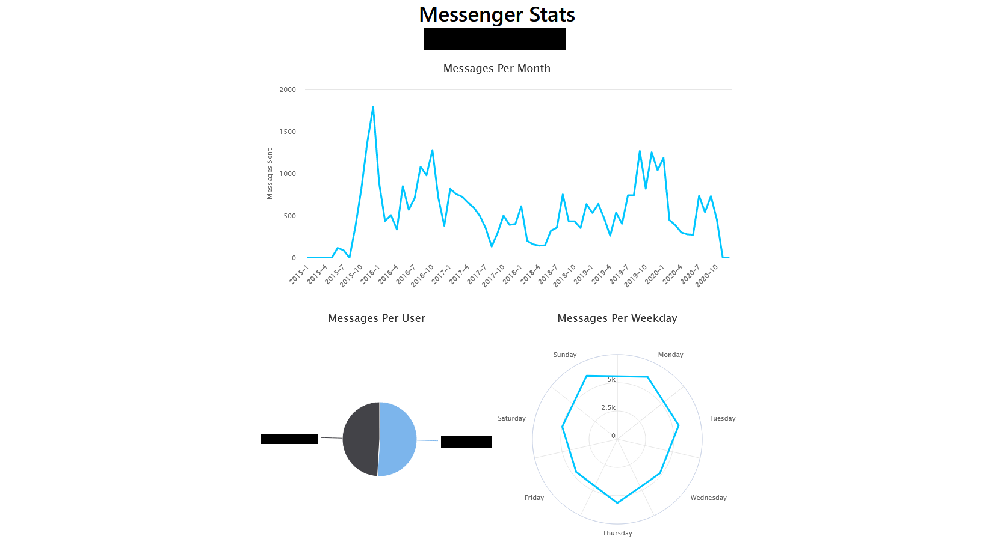

# MessengerStats

View statistics about your Messenger conversations

## Example

(Names censored)

## Architecture

The app is a basic http web server but, for obvious reasons, isn't hosted on the internet. To use it, download and run
one of the pre-built binaries (or build it yourself) and then go to the URL it gives you.

It uses basic HTML forms for data transfer, and the calculations for even lots of files shouldn't take very long; on my
machine it takes ~200ms to upload, parse, and calculate statistics for a 20.8 MB conversation split over 11 files
(Almost all of that time is from the calls to `ParseMultipartForm` and `UnmarshalJSON`, the actual statistics
calculations currently take ~2ms per MB).

## Credits

- [water.css](https://watercss.kognise.dev/)
- [chart.js](https://www.chartjs.org/)
- [chartjs-plugin-labels](https://github.com/emn178/chartjs-plugin-labels)
